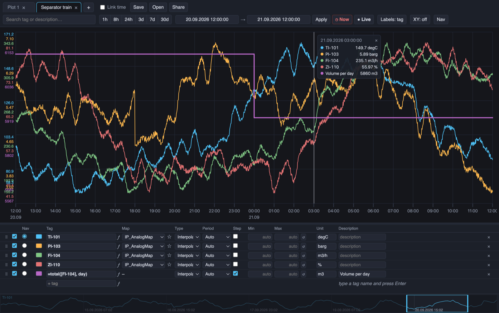
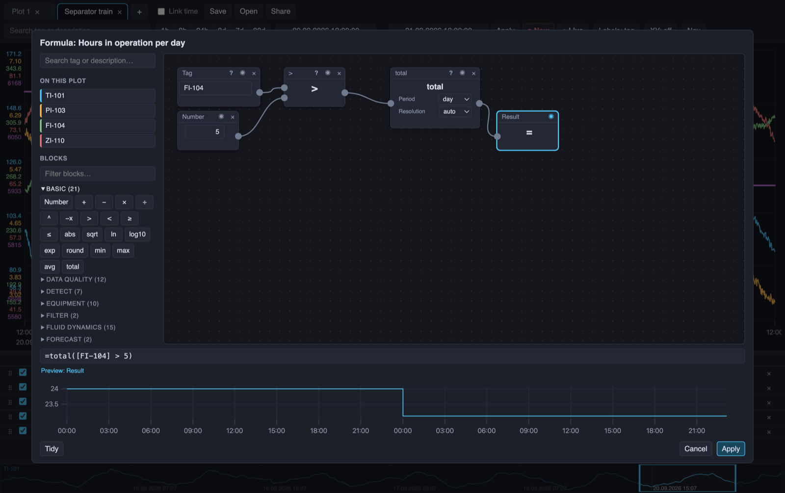

# IP21 Explorer

A fast, browser-based trend viewer for AspenTech IP21 process data — built as a
snappier alternative to Aspen Process Explorer. The whole application is a
single Python server (FastAPI) serving a static frontend, so it runs anywhere
Python runs; no Node, no build step, no external CDNs.


[](LICENSE)

Source: [github.com/jonasdig/ip21-explorer](https://github.com/jonasdig/ip21-explorer)





*A formula built from blocks: FI-104 above 5 m3/h, summed per day — the hours
the pump ran. The preview follows along while it is built.*

## Features

### The plot

- **A full-screen plot per tab**, each with its own tags and time range; tabs
  that tick *Link time* share one range
- **Time presets** (1h–30d), typed ranges, drag and wheel zoom, `Esc` to zoom
  back, and a **Live** mode that follows now
- **XY plot**: tags against a shared x tag, each point coloured by when it is,
  so drift shows as the cloud moving rather than as trends compared by eye
- **CSV export** and **average between scooters** from the chart's right-click
  menu

### Tags

- **Settings table** under the plot: tag name, colour, record map, sampling
  type and interval, step, min/max, unit and description, all editable in
  place. Rows drag to reorder, columns drag to move or resize
- **Search** over tag names *and* descriptions, with `*` wildcards: pair part
  of a tag with a word from its description (`TIC-24 temperature`) and both
  must match
- **Sampling per tag**: interpolated, average, min or max over an interval (or
  Auto), like Process Explorer's Type and Period columns
- **Record maps**: plot `TAG;MAP` (e.g. `TIC-102;OUTPUT`), chosen per row. The
  same tag can be plotted several times, each on its own map. Star the maps you
  use to sort them to the top everywhere
- **Copy/paste** rows with the right-click menu or `Ctrl+C` / `Ctrl+V`; tags
  travel as JSON, so they can be pasted between tabs, windows and machines

### Formulas

- **A row whose tag name starts with `=`** is arithmetic over other tags:
  `=[TI-101] - [TI-201]`, `=([FI-104]*2)^0.5`, `=avg([TI-101],[TI-201])`, with
  `+ - * / ^`, parentheses and comparisons (`>` `<` `>=` `<=`, giving 1 or 0).
  References go in brackets, since every IP21 tag has a hyphen in it
- **Totals per calendar period**: `=total([FI-104], day)` turns m3/h into m3
  per day, `=total([FI-104] > 5, day)` counts the hours a pump ran
- **A function library**: the basics (`abs`, `sqrt`, `min`, `max`, `avg`, …)
  plus [indsl](https://github.com/cognitedata/indsl) — filtering, smoothing,
  resampling, drift and outlier detection, data quality, forecasting,
  statistics and fluid-dynamics calculations, grouped by toolbox
- **Block editor**, opened with the *ƒ* after a row's tag name: the same
  formulas as blocks and wires, with every block explaining itself on hover.
  The text stays the truth — *Apply* writes it into the Tag field, and typing
  there rebuilds the blocks

### Keeping a plot

- **Save and open** named plot configurations on the server, with free-text
  labels for grouping them; **Open all** opens every listed plot in its own tab
- **Import/export** a single plot or a whole set as one file — a saved plot
  restores exactly, down to scooters, colours, scales, maps and sampling
- **Share links** carry the whole plot in the URL fragment, so nothing is
  stored server-side

## Installation

Python 3.11 or newer (the function library needs it); tested on 3.13.

```bash
git clone https://github.com/jonasdig/ip21-explorer.git
cd ip21-explorer
python3 -m venv .venv
.venv/bin/pip install -e ".[aspen]"   # ".[dev]" for the simulator and tests
```

Then start it, against the simulator or against live IP21:

```bash
.venv/bin/python -m ip21_explorer.main --source sim --port 8021   # simulator
.venv/bin/python -m ip21_explorer.main                            # live IP21
```

Open http://localhost:8021. The simulator needs no plant access and produces
deterministic trends; add `--latency 0.5` to imitate a slow historian. Live
IP21 needs network access to an aspenONE ProcessData REST endpoint (the same
one Aspen Process Explorer's web components use) — see Configuration below.

Run the tests with `.venv/bin/pytest`.

To install without a clone, into a virtual environment of your own:

```bash
pip install "ip21-explorer[aspen] @ git+https://github.com/jonasdig/ip21-explorer.git"
```

The server then starts as `ip21-explorer` (same options as above).

## Configuration (live IP21 data)

Copy [ip21.env.example](ip21.env.example) to `ip21.env` next to where you start
the server and fill in the endpoint and datasource; the file is picked up
automatically (or pass `--config myfile.env`). Then start with:

```bash
python -m ip21_explorer.main
```

Plain environment variables still work and override the file:

```bash
set IP21_ASPEN_URL=https://<server>/ProcessData/AtProcessDataREST.dll
set IP21_ASPEN_DATASOURCE=<your IP21 datasource name>

python -m ip21_explorer.main --source aspen --port 8021
```

If the datasource name is unknown, list what the server offers:

```bash
python -m ip21_explorer.main --source aspen --list-sources
```

Data access goes through [tagreader-python](https://github.com/equinor/tagreader-python)
(`imstype="aspenone"`), which handles authentication (NTLM/Kerberos via the
logged-in Windows user), the REST protocol, and `TAG;MAP` addressing.

Optional environment variables:

| Variable | Purpose |
| --- | --- |
| `IP21_VERIFY_SSL=0` | Skip TLS verification when a corporate proxy breaks it |
| `IP21_TZ` | Timezone the server reports timestamps in (default `Europe/Oslo`) |
| `IP21_PLOTS_DIR` | Where saved plots are stored (default `./plots`) |
| `IP21_DESC_SCAN_MAX` | How many name-matched tags get a description lookup (default `100`, `0` disables) |
| `IP21_READ_WORKERS` | Tags of one request read from IP21 side by side (default `4`) |
| `IP21_AGG_MAX_ROWS` | Most rows IP21 returns for one Average/Minimum/Maximum read (default `10000`); longer reads are split |
| `IP21_HOST`, `IP21_PORT` | Bind address (default `127.0.0.1:8021`) |

Saved plots are written to `./plots/*.json` (override with `IP21_PLOTS_DIR`).

## Upgrading

```bash
pip install --upgrade "ip21-explorer[aspen] @ git+https://github.com/jonasdig/ip21-explorer.git"
```

Then restart the server. Saved plots (`plots/*.json`), your `ip21.env` and the
per-browser state (open tabs, colors, scooters) are untouched. The version
running is the first line the server logs at startup.

## Architecture

```
src/ip21_explorer/
  main.py        FastAPI app: the JSON API and the static files
  config.py      Settings from env vars and the command line
  calc/          Formulas - parser, evaluator, and the function catalog built
                 from indsl - independent of the web app, so a future alarm
                 service can use the same engine
  sources/       simulator.py (deterministic trends for development) and
                 aspen.py (tagreader, live IP21) behind one small protocol
  static/        The frontend: vanilla ES modules and vendored uPlot (MIT)
tests/           pytest: the simulator, the API, the formulas, and a scan of
                 the ES modules that catches a broken import without a browser
```

## License

MIT — see [LICENSE](LICENSE).

`src/ip21_explorer/static/vendor/` bundles [uPlot](https://github.com/leeoniya/uPlot)
(MIT, see [LICENSE-uplot.txt](src/ip21_explorer/static/vendor/LICENSE-uplot.txt)).
Formula functions come from [indsl](https://github.com/cognitedata/indsl)
(Apache 2.0, see [NOTICE](NOTICE)), and data access on live systems goes
through [tagreader-python](https://github.com/equinor/tagreader-python) (MIT).

This project is not affiliated with, endorsed by, or sponsored by Aspen
Technology, Inc. IP.21, InfoPlus.21, and Aspen are trademarks of Aspen
Technology, Inc.
